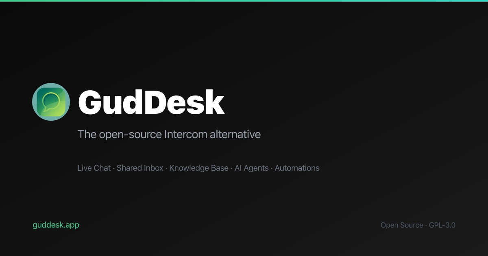

<p align="center">
  <a href="https://guddesk.com">
    
  </a>
</p>

<p align="center">
  <strong>The open-source customer messaging platform.</strong><br />
  Live chat, shared inbox, knowledge base, AI-powered support, and automations — all in one place.
</p>

<p align="center">
  <a href="https://guddesk.com">Website</a> ·
  <a href="https://guddesk.com/docs">Documentation</a> ·
  <a href="https://github.com/gudlab/guddesk-core/issues">Issues</a> ·
  <a href="https://guddesk.com/blog">Blog</a>
</p>

---

## About

GudDesk is a free and open-source alternative to Intercom, Zendesk, and Freshdesk. It gives your team everything needed to deliver fast, personal customer support — without per-seat pricing or feature gates.

Built by [GudLab](https://gudlab.com).

### Key Features

- **Live Chat Widget** — Embeddable, customizable widget with real-time messaging via Pusher
- **Shared Inbox** — Manage all customer conversations in one place with assignment, tagging, and prioritization
- **Knowledge Base** — Create and organize help articles with collections, publishing workflow, and a public help center
- **AI-Powered Support** — Reply suggestions, conversation summaries, auto-categorization, sentiment analysis, and smart article recommendations (powered by Claude)
- **AI Agent Plugins** — Connect external bots via REST API and webhooks. Bot messages appear natively in the widget and inbox
- **Automations** — Rule-based workflows triggered by conversation events (created, closed, message received, tag added, etc.)
- **Slack Integration** — Get notified in Slack when new conversations arrive
- **Visitor Management** — Track visitors with metadata, identify returning users
- **Canned Responses** — Pre-built reply templates for common questions
- **Analytics** — Dashboard with conversation volume, response times, and resolution metrics
- **Self-Hosted** — Deploy on your own infrastructure. Your data stays on your servers

## Tech Stack

| Layer | Technology |
|-------|-----------|
| Framework | [Next.js 16](https://nextjs.org) (App Router) |
| Language | [TypeScript](https://typescriptlang.org) |
| Database | [PostgreSQL](https://postgresql.org) via [Prisma 7](https://prisma.io) |
| Auth | [Auth.js v5](https://authjs.dev) (NextAuth) |
| Real-time | [Pusher](https://pusher.com) |
| AI | [Anthropic Claude](https://anthropic.com) |
| Email | [Resend](https://resend.com) + [React Email](https://react.email) |
| UI | [Tailwind CSS v4](https://tailwindcss.com), [Radix UI](https://radix-ui.com), [shadcn/ui](https://ui.shadcn.com) |
| Widget | [Preact](https://preactjs.com) + [Vite](https://vitejs.dev) (Shadow DOM) |
| Content | [Contentlayer](https://contentlayer.dev) (docs & blog) |
| Deployment | [Vercel](https://vercel.com) (or any Node.js host) |

## Getting Started

### Prerequisites

- **Node.js 20+** (we recommend using [nvm](https://github.com/nvm-sh/nvm))
- **pnpm** (`npm install -g pnpm`)
- **PostgreSQL** database (e.g., [Neon](https://neon.tech), [Supabase](https://supabase.com), or local)

### 1. Clone and install

```bash
git clone https://github.com/gudlab/guddesk-core.git
cd guddesk-core
pnpm install
```

### 2. Set up environment variables

```bash
cp .env.example .env
```

Fill in the required variables:

```env
# Required
DATABASE_URL="postgresql://..."
AUTH_SECRET="your-secret-here"           # Run: openssl rand -base64 32
NEXT_PUBLIC_APP_URL="http://localhost:3000"
RESEND_API_KEY="re_..."
GOOGLE_CLIENT_ID="..."
GOOGLE_CLIENT_SECRET="..."

# Optional — Real-time messaging
PUSHER_APP_ID="..."
PUSHER_SECRET="..."
NEXT_PUBLIC_PUSHER_KEY="..."
NEXT_PUBLIC_PUSHER_CLUSTER="..."

# Optional — AI features (reply suggestions, summaries, etc.)
ANTHROPIC_API_KEY="sk-ant-..."

# Optional — Slack integration
SLACK_CLIENT_ID="..."
SLACK_CLIENT_SECRET="..."
```

### 3. Set up the database

```bash
pnpm prisma generate
pnpm prisma db push
```

### 4. Build the chat widget

```bash
pnpm run build:widget
```

### 5. Start the dev server

```bash
pnpm dev
```

Open [http://localhost:3000](http://localhost:3000) — create an account, set up your first workspace, and embed the chat widget on your site.

### Widget Installation

Add this snippet to your website, just before the closing `</body>` tag:

```html
<script>
  window.gudDeskSettings = { appId: "YOUR_APP_ID" };
</script>
<script src="https://your-domain.com/widget.js" async></script>
```

Replace `YOUR_APP_ID` with the App ID from your workspace settings, and `your-domain.com` with your GudDesk deployment URL.

## Project Structure

```
guddesk-core/
├── app/                    # Next.js App Router pages & API routes
│   ├── (auth)/             # Login, register, password reset
│   ├── (marketing)/        # Landing pages, blog, docs
│   ├── (protected)/        # Dashboard & workspace pages
│   └── api/                # REST API routes (widget, pusher, cron, etc.)
├── actions/                # Server actions (create workspace, send message, AI, etc.)
├── components/             # React components (UI, dashboard, widget preview, etc.)
├── config/                 # Site, dashboard, and marketing configuration
├── content/                # MDX content (docs, blog posts, legal pages)
├── emails/                 # React Email templates
├── hooks/                  # Custom React hooks
├── lib/                    # Shared utilities (db, auth, AI, workspace, etc.)
├── packages/
│   └── widget/             # Preact-based chat widget (builds to public/widget.js)
├── prisma/
│   └── schema.prisma       # Database schema
├── public/                 # Static assets & built widget
└── types/                  # TypeScript type definitions
```

## AI Features

GudDesk integrates with Anthropic's Claude to provide:

- **Reply Suggestions** — AI-generated response drafts based on conversation context
- **Conversation Summaries** — One-click summaries for long conversations
- **Auto-Categorization** — Automatically tag conversations by topic
- **Sentiment Analysis** — Detect customer frustration or satisfaction
- **Article Suggestions** — Recommend relevant knowledge base articles

To enable AI features, set the `ANTHROPIC_API_KEY` environment variable. All AI features work with your own API key — no additional charges from GudDesk.

## AI Agent Plugins

GudDesk supports external AI agents that connect via the REST API:

1. **Listen** to webhook events (new message, conversation created, tag added, etc.)
2. **Read** conversation history and knowledge base articles via the API
3. **Respond** by sending messages as the `BOT` message type
4. **Take actions** — assign conversations, add tags, change status

Bot messages appear natively in both the chat widget and the agent inbox. Build agents in any language — Python, TypeScript, Go — using GudDesk's REST API.

## Deployment

### Vercel (Recommended)

1. Push your repo to GitHub
2. Import into [Vercel](https://vercel.com)
3. Set environment variables in the Vercel dashboard
4. Deploy — Vercel handles the build automatically

### Docker (Coming Soon)

Docker Compose support for self-hosted deployments is in development.

### Manual

```bash
pnpm install
pnpm run build
pnpm start
```

## Contributing

We welcome contributions! Here's how to get started:

1. Fork the repository
2. Create a feature branch: `git checkout -b feature/my-feature`
3. Make your changes and commit: `git commit -m "Add my feature"`
4. Push to your fork: `git push origin feature/my-feature`
5. Open a pull request

Please ensure your code passes TypeScript checks (`pnpm tsc --noEmit`) before submitting.

## License

GudDesk Core is open source under the [AGPL-3.0 license](LICENSE).

## Acknowledgments

GudDesk is built on the shoulders of amazing open-source projects including Next.js, Prisma, Tailwind CSS, Radix UI, Auth.js, and many more. We're grateful to the open-source community.

---

<p align="center">
  Built with care by <a href="https://gudlab.com">GudLab</a>
</p>
